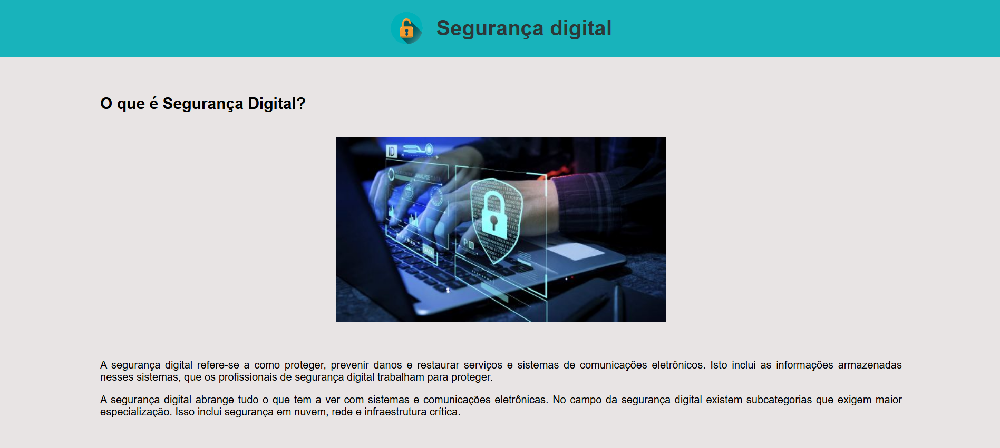
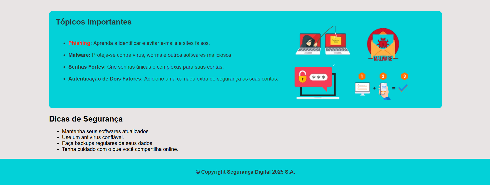

# Segurança Digital 🔐

Este projeto tem como finalidade consolidar conhecimentos adquiridos em duas disciplinas: Programação Web e Segurança da Tecnologia da Informação.

## Principais recursos implementados

- A prática da programação web utilizando containers semânticos (header, main, footer) e containers flexíveis (div);

- A estilização com CSS externo, utilizando classes para organização e reaproveitamento de estilos;

- A fixação de conceitos essenciais sobre Segurança da Informação.

## Preview

## Como acessar

[Acesse aqui o projeto online](https://p4ul4v3rs0.github.io/Seguranca-digital/)
